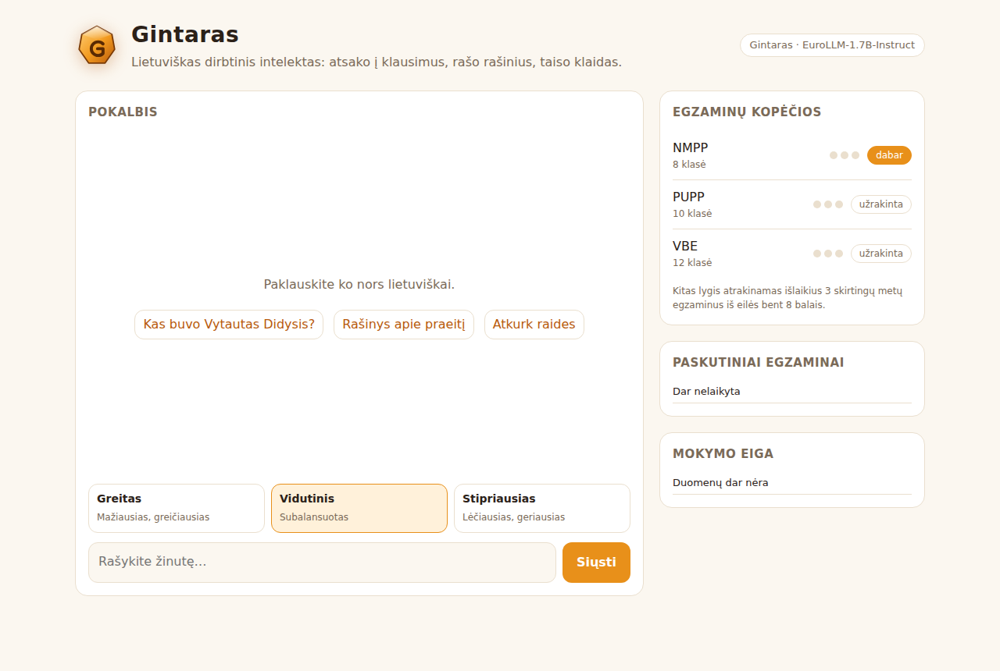

# Gintaras — Lithuanian-first LLM

A complete training pipeline that turns an open multilingual model into a strong
**Lithuanian** assistant: answering questions from a given text, writing essays,
summarizing, translating, correcting grammar, explaining, reasoning — all in
correct, natural Lithuanian.

> **Honest expectations.** No one can promise a "perfect" model. This pipeline
> does what the strongest open recipes do (continued pretraining → distillation
> from bigger models → SFT → iterative DPO with an LLM judge) and measures
> progress, so you can push quality as far as your data and GPUs allow.
> It needs real GPUs: training is **not** possible on a laptop CPU.



## Goal: pass real Lithuanian exams

After every training round the model sits **real past exams** from the National Agency for Education (NŠA).
It climbs a ladder and moves up only after passing **3 exams from different years in a row with at least 8/10**:

| Level | Exam | Papers available (with official marking keys) |
|---|---|---|
| 1 | NMPP, 8th grade (reading, writing) | 2014–2018 |
| 2 | PUPP, 10th grade (test) | 2012, 2016–2019 |
| 3 | VBE, 12th grade | 2023–2025 |

Lithuania has no national exam in 9th grade, so the ladder goes 8 → 10 → 12.

Grading follows the official keys. Multiple-choice answers and word forms are matched exactly. Spelling and punctuation tasks are graded by error count using the official error tables. Open answers and essays are scored by an LLM judge that is given the official marking key. A grade is 10 × the share of points, so 8/10 means at least 75 %. VBE is also shown on its 0–100 scale.
Commands: `gintaras exams-fetch` downloads the papers, `gintaras exams-convert` converts them (needs the judge LLM), and `gintaras exam` sits the next exams.
Exam papers are downloaded locally and are not committed.

## Front page

`gintaras serve -c <config>` starts a web page with:
- a chat box,
- three strength levels: **Greitas** (fast, greedy), **Vidutinis** (balanced) and **Stipriausias** (best: 4 candidates, keeps the one the model is most confident in),
- live exam-ladder and training progress.

`gintaras report -c <config>` writes a progress chart PNG.

## Training without / with a GPU

* **CPU only:** `configs/gintaras-1.7b-cpu.yaml` slowly trains the small EuroLLM-1.7B on real Lithuanian data plus teacher-free exercises (diacritics, error correction). It improves, but don't expect 8/10 on exams.
* **Rented GPU:** see **[docs/GPU.md](docs/GPU.md)**. One command (`scripts/gpu_bootstrap.sh`) trains the 9B model and keeps going until the exam ladder is done.

## How it works

```
 Lithuanian corpora ──► 1. prepare ──► 2. CPT (continued pretraining on LT text)
 (Wikipedia, FineWeb-2)                         │
 LT instruction sets ─┐                         ▼
                      ├──────────────► 4. SFT ◄── 3. synth: multi-teacher distillation
 teacher models ──────┘                         │      (teachers answer, judge picks best)
 (Qwen3-235B, EuroLLM-22B)                      ▼
                                       5. DPO (judge-ranked best vs worst answers)
                                                │
                                                ▼
                         6. improve: self-improvement loop, repeated until the
                            target score is reached or progress stalls:
                            student answers → teachers answer → judge scores →
                            DPO on (best, student's worst) + SFT where it failed →
                            evaluate → keep only if better
```

* **Student (base):** `utter-project/EuroLLM-9B-Instruct-2512` (Apache-2.0, trained on all EU languages incl. Lithuanian). Any HF causal LM works — set `model.base`.
* **Learning from other models:** several *teachers* answer every prompt; a *judge* scores them with a Lithuanian rubric (grammar, diacritics, no anglicisms, faithfulness to context, helpfulness). Teachers get a detailed Lithuanian style guide in their prompt; the student is trained without it, so it internalizes the guide ("context distillation").
* **Grounded QA:** trained to answer only from the given text and to say *„Pateiktame tekste atsakymo į šį klausimą nėra.“* when the answer is missing.
* **Self-supervised tasks** with gold answers from real Lithuanian text: diacritic restoration, error correction, back-translation (EN→LT target is human-written Lithuanian).

Task mix (`configs/gintaras-9b.yaml` → `synth.task_weights`): context QA, unanswerable QA, summaries, rewriting, essays (VBE style), open questions, reasoning/math, creative writing, formal letters, grammar fixes, diacritics, translation.

## Quickstart

```bash
pip install -e ".[gpu,dev]"

# 1. Smoke test on CPU (tiny model + offline dummy teachers, ~2 min) — checks the plumbing
pytest                     # unit tests
pytest -m slow             # full pipeline end-to-end
gintaras all -c configs/smoke.yaml

# 2. Real run
bash scripts/serve_teachers.sh          # teachers/judge via vLLM (OpenAI-compatible API)
gintaras all -c configs/gintaras-9b.yaml
```

Or stage by stage:

```bash
C=configs/gintaras-9b.yaml
gintaras prepare -c $C      # download, clean, LT-filter, dedup → runs/.../data/
gintaras synth   -c $C      # distillation → synth_sft.jsonl, synth_dpo.jsonl
gintaras cpt     -c $C      # continued pretraining   → checkpoints/cpt
gintaras sft     -c $C      # supervised fine-tuning  → checkpoints/sft
gintaras dpo     -c $C      # preference optimization → checkpoints/dpo
gintaras improve -c $C      # self-improvement loop   → BEST_MODEL
gintaras eval    -c $C      # metrics → runs/.../eval/<model>.json
gintaras exam    -c $C      # sit the exam ladder
gintaras serve   -c $C      # front page
gintaras report  -c $C      # progress PNG
```

Use it:

```bash
gintaras chat  -c $C
gintaras ask   -c $C --context straipsnis.txt --question "Kada įkurtas Vilniaus universitetas?"
gintaras essay -c $C --topic "Ar žmogui reikia praeities?" --words 500
```

Override any config value: `--set sft.epochs=3 --set model.base=Qwen/Qwen3-8B`.

## Hardware

| Stage | Minimum | Comfortable |
|---|---|---|
| Student 9B (QLoRA CPT/SFT/DPO) | 1× 24–48 GB GPU | 1× 80 GB A100/H100 |
| Teacher Qwen3-235B-A22B (vLLM) | 4× 80 GB (FP8) | 8× 80 GB |
| Teacher EuroLLM-22B (vLLM) | 1× 80 GB | 2× 80 GB |

Smaller budget: use one teacher (e.g. `Qwen/Qwen3-30B-A3B-Instruct-2507` on one GPU), lower `synth.num_prompts`, cap `fineweb-2` with `max_docs`.

## Evaluation

`gintaras eval` writes `runs/<name>/eval/<model>.json` (+ sample outputs):

| Metric | Meaning |
|---|---|
| `bpc` | bits per character on held-out Lithuanian text (lower = better language modeling) |
| `qa_f1` | grounded QA F1, inflection-tolerant (held-out + `data/eval/gold_context_qa.jsonl`) |
| `qa_unanswerable_acc` | says "not in the text" when it isn't |
| `diacritics_word_acc` | restores ą č ę ė į š ų ū ž |
| `lt_consistency` | answers stay in Lithuanian |
| `judge_*` | 1–10 judge scores on `data/eval/judge_prompts.jsonl` (essays, letters, explanations, math…) |

The loop keeps a new model only if its score improves, and stops at `loop.target_score` (default 9.0/10) or after `loop.patience` rounds without gains. Eval prompts are never used for training.

## Data & licensing

| Source | Use | License |
|---|---|---|
| `wikimedia/wikipedia` `20231101.lt` | pretraining, grounding passages | CC BY-SA |
| `HuggingFaceFW/fineweb-2` `lit_Latn` | pretraining | ODC-By |
| `ArturG9/Lithuanian_Context_QA` | context QA (SFT + eval) | Apache-2.0 |
| `neurotechnology/lithuanian-qa-v1` | QA (SFT) | not stated — check before commercial use |
| `saillab/alpaca-lithuanian-cleaned` | instructions (machine-translated; filtered) | not stated — check before commercial use |

**Teachers must allow training on their outputs.** The defaults (Qwen3, EuroLLM) are Apache-2.0. Commercial APIs such as Claude or GPT prohibit using their outputs to train competing models, so they are not used as teachers here.

## Layout

```
configs/            gintaras-9b.yaml (multi-GPU), gintaras-9b-2gpu.yaml (rented 2-GPU box),
                    gintaras-1.7b-cpu.yaml (CPU only), smoke.yaml (CPU test)
data/exams/         catalog.yaml: past NŠA exam papers + marking keys
data/eval/          hand-written Lithuanian eval sets (never trained on)
scripts/            serve_teachers.sh
src/gintaras/
  lt.py             Lithuanian text utils: language score, diacritics, cleaning, stems
  data/prepare.py   corpus + instruction datasets → cleaned JSONL
  data/tasks.py     task catalogue, Lithuanian prompt templates, seed topics
  data/synth.py     multi-teacher distillation + judge filtering
  backends.py       teacher/judge backends (OpenAI-compatible, local HF, dummy)
  judge.py          Lithuanian judge rubric + parsing
  train.py          CPT / SFT / DPO with (Q)LoRA + merging
  loop.py           iterative self-improvement
  evaluate.py       metrics
  exams.py          exam ladder: fetch, convert, grade (official keys + judge)
  server.py, web/   front page (chat with strength levels, progress)
  report.py         progress chart PNG
  cli.py            `gintaras` command
tests/              unit tests + end-to-end smoke test
```
